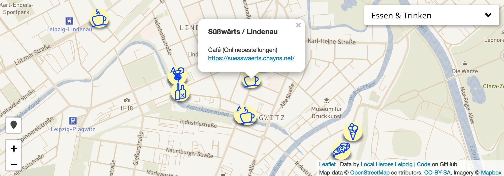

## Local Heroes Leipzig - Map

This project is taking data from the [Local Heroes Leipzig](http://local-heroes-leipzig.de/) project and tries to find geo location info for each entry. The resulting data is displayed in a customizable map that can be embedded on a website.

This repository consists of 2 parts:

1. A python script that parses data from the website and adds location data to it.
2. A JavaScript class that renders an HTML map that displays the data



You can embed the map on your own website by adding the following code:

```html
<div id="mapid" style="height: 200px;"></div>
<script src="https://cdn.jsdelivr.net/gh/r-dent/LocalHeroesLeipzig@master/docs/map.js" onload="new LocalHeroesMap('mapid')"></script>
```

If you want to customize the map, you can pass some options to the initializer.

```html
<div id="mapid" style="height: 200px;"></div>
<script src="https://cdn.jsdelivr.net/gh/r-dent/LocalHeroesLeipzig@master/docs/map.js"></script>
<script>
    var localsMap = new LocalHeroesMap('mapid', {
        mapBoxKey: 'your_mapbox_key',
        mapBoxStyle: 'username/your_style_id',
        clusterBelowZoom: 15,
        showLocateButton: true,
        showCategorySelection: true
    })
</script>
```

### Initializer options

 Option | Type | Description | Default
 --- | --- | --- | ---
 `showLocateButton` | `boolean` | If you want to show a button that let´s the user zoom to his/her own location. | `false`
 `showCategorySelection` | `boolean` | Show a category selection dropdown in the top right corner of the map. | `true`
 `clusterBelowZoom` | `number` | You can use clustering to group multiple markers into one for a better overview. To do that just provide a zoom level below which items will get clustered. | `undefined`
 `onDataReady` | `function` | A Handler that will be called after loading is done and the map is ready. The resutling categories will be passed as data. | `undefined`
 `mapBoxStyle` | `string` | If you have customized your own map style with [Mapbox](https://www.mapbox.com/), you can use it for rendering by providing this parameter together with your Mapbox API key. If your Mapbox Style URL is something like `mapbox://styles/username/your_style_id`, use `username/your_style_id` for this parameter. If you don´t have a Mapbox account, [OpenStreetMap](https://www.openstreetmap.org) will be used as fallback. | `undefined`
 `mapBoxKey` | `string` | Your API key from [Mapbox](https://www.mapbox.com/). | `undefined`

 ### Custom category selection

 Here´s an example how to create custom controls for the category selection.

 ```html
<div id="mapid" style="height: 200px"></div>
<div id="button-container"></div>
<script src="map.js"></script>
<script>
    var map = new LocalHeroesMap('mapid', {
        showCategorySelection: false,
        onDataReady: function(categories) {
            var buttonsHTML = ''
            for (index in categories) {
                category = categories[index]
                buttonsHTML += '<button onclick="map.selectCategory(\''+ category +'\')">'+ category +'</button>\n'
            }
            document.getElementById('button-container').innerHTML = buttonsHTML
        }
    })
</script>
 ```

Please [file an issue](https://github.com/r-dent/LocalHeroesLeipzig/issues/new) or [contact me](https://romangille.com/#contact) if you have feedback.
